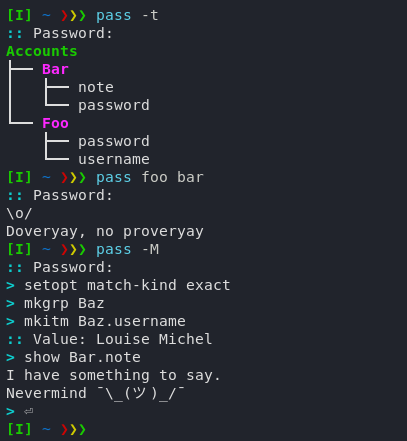

# pass-rs

`pass-rs` is a program for managing encrypted textual data. Its primary use is
as a password manager, but its features permit other use cases. Contributions
are welcome, especially in the form of security testing.



Notable features include:

- Clipboard support
- An interactive TUI for editing
- Versatile data format (exportable, arbitrary depth...)
- ChaCha20-Poly1305 encryption with Argon2id for key generation
- Crash protection and recovery

## Installation

### With Cargo

To install and update:
```
cargo install passers
```

To uninstall:
```
cargo uninstall passers
```

### Manual

To install:
```
git clone https://github.com/Swarthe/pass-rs
cd pass-rs
make && sudo make install
```

To update:
````
git pull
make && sudo make install
````

To uninstall:
```
sudo make uninstall
```

## Usage

```
Usage: pass [OPTION...] [TARGET...]
Securely manage hierarchical data.

  -c, --clip        copy target item to primary clipboard instead of displaying
  -l, --list        list the target's contents (root if not specified)
  -t, --tree        display a tree of the target (root if not specified)

  -e, --exact       find exact match of target (default: fuzzy match)
  -d, --duration    time in seconds to keep target in clipboard (default: 10)
  -f, --file        specify a pass file (default: standard data file)

  -M, --modify      launch editing interface (respects '-e' and '-d')
  -P, --change-pw   change the pass file's password

  -E, --export      output data in serial form
  -I, --import      create a pass file from serial data (read from stdin)
  -C, --create      create an empty pass file with the specified root name

  -h, --help        display this help text
  -v, --version     display version information

Note: By default, the target item is printed to standard output.
      Targets are passed as dot-separated record paths.
      Passing a group as a target item implies its child item 'password'.

Example: pass -d5 -c foo.bar
```

## TODO: program documentation

Document encryption and security with links to further docs (Argon2id and
XChaCha20Poly1305, best available).

Standard man page also with environment info etc., and advice to see it in help
text.

document that we can configure with `config.rs`

document where the data is stored by default
- XDG data directory
- backups in [XDG data]/backup

The focus of this program (and what mainly distinguishes from other similar
ones) is on maximum possible security and strict safety, with usability and
performance as important secondary objectives. Unlike zx2c4's `pass`
[hyperlink], this program rejects the Unix philosophy for its purpose, as it
requires us to trust other programs in order to extend functionality. In the
context of highly sensitive data, we consider this an unacceptable breach of
security, and extra functionality is instead built into the program as far as
possible. `pass-rs` also includes crash / data corruption protection, and
various security measures to protect the data.

Document particularities of fuzzy matching to help users
([docs](https://crates.io/crates/sublime_fuzzy))
smartcase etc.

## TODO: features

Rofi integration (optional and separate, see other similar implementations)/

Password generation maybe with real words etc so can be remembered
(customisable).

Maybe include more metadata like creation date.

## TODO: distribution

Distribute as statically linked (portable) binary, and as source with AUR.

Perhaps cross-platform (at least Unix/POSIX).

Possibly add to the Free Software Directory (we are gplv3)

## TODO: dependencies

- `rustc` and `cargo`
- Internet connection (for initial installation and updates)
- Unix system (currently only tested on Arch Linux)

## License

Copyright (C) 2023 Emil Overbeck `<emil.a.overbeck at gmail dot com>`.

This file is part of `pass-rs`.

This software is free software: you can redistribute it and/or modify it under
the terms of the GNU General Public License as published by the Free Software
Foundation, either version 3 of the License, or (at your option) any later
version.

`pass-rs` is distributed in the hope that it will be useful, but WITHOUT ANY
WARRANTY; without even the implied warranty of MERCHANTABILITY or FITNESS FOR
A PARTICULAR PURPOSE. See the GNU General Public License for more details.

You should have received a copy of the GNU General Public License along with
`pass-rs`. If not, see <https://www.gnu.org/licenses/>.
